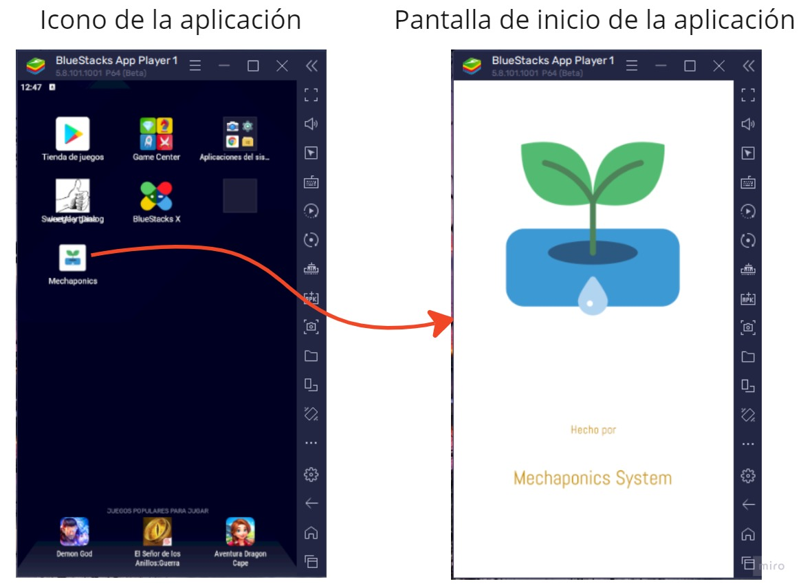
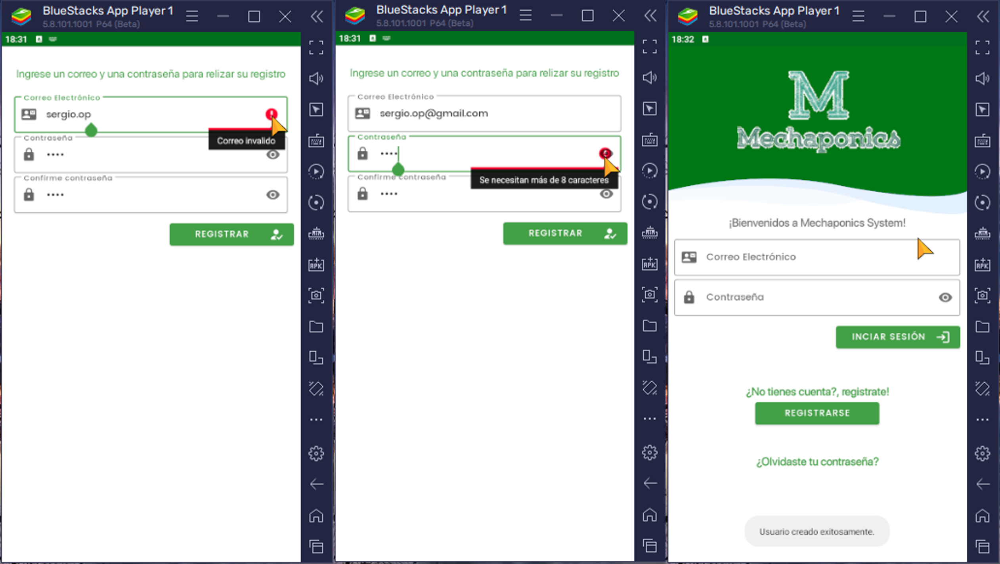
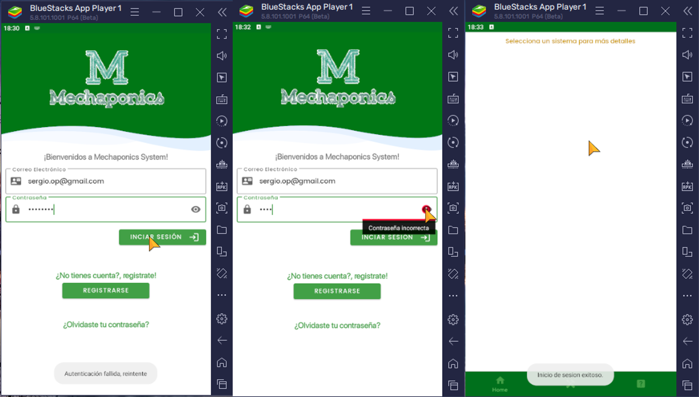
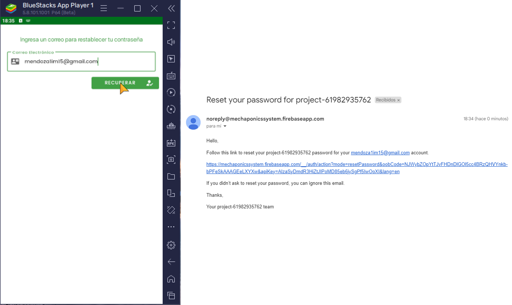
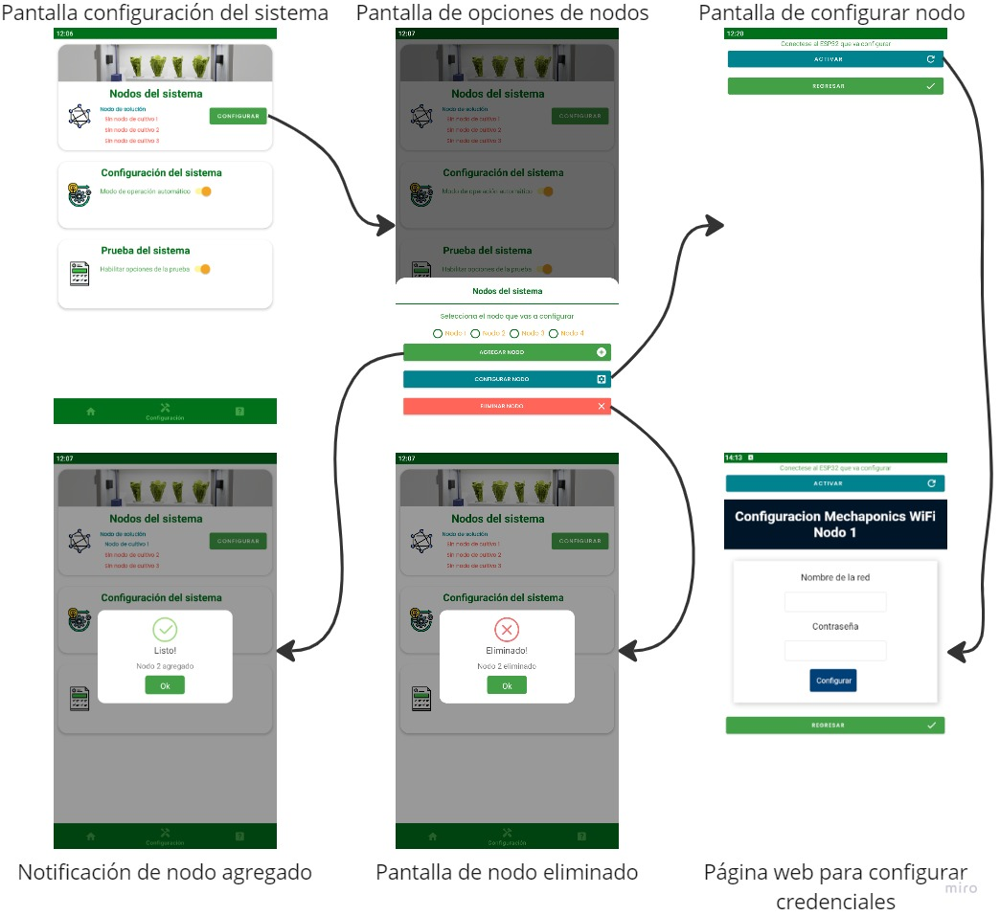
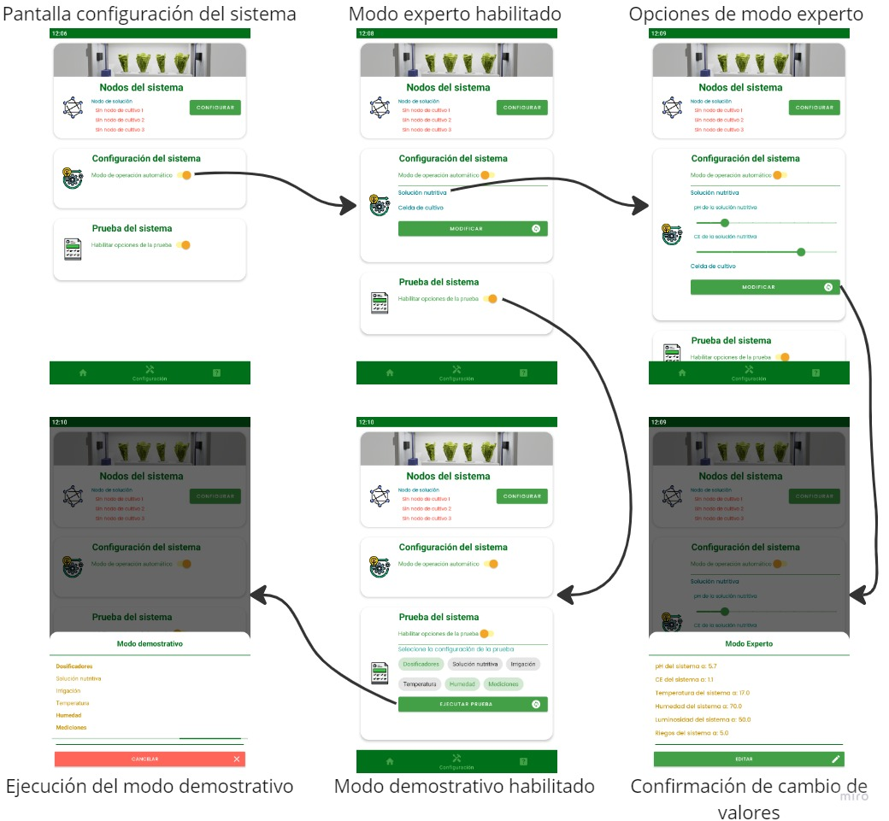
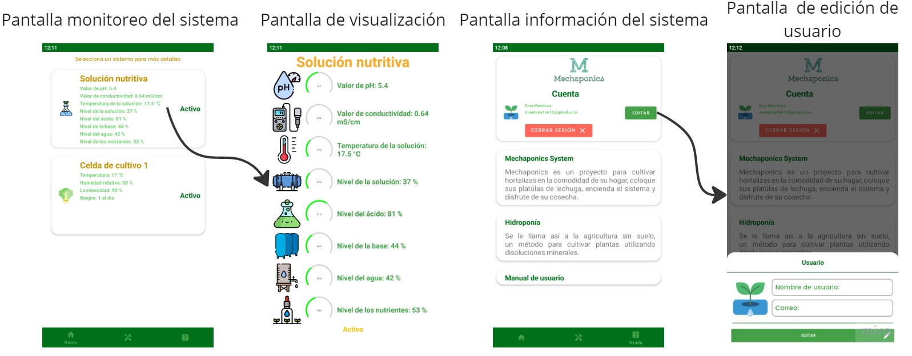

# MechaponicsApp

Aplicacion movil Android para el monitoreo y control de un sistema hidroponico automatizado Mechaponics. Permite visualizar en tiempo real los parametros de la solucion nutritiva y las celdas de cultivo, asi como configurar perfiles y ejecutar modos de demostracion.

## Tecnologias

- **Lenguaje:** Java 11
- **IDE:** Android Studio
- **Min SDK:** 28 (Android 9) | **Target SDK:** 32 (Android 12)
- **Base de datos en la nube:** Firebase Realtime Database
- **Autenticacion:** Firebase Authentication

## Dependencias principales

| Libreria | Uso |
|---|---|
| Firebase Auth 21.0.7 | Autenticacion de usuarios (email/password) |
| Firebase Database 20.0.5 | Lectura/escritura de datos en tiempo real |
| Material Design 1.6.1 | Componentes de interfaz |
| SimpleGauge | Visualizacion de medidores tipo arco |
| SweetAlert | Dialogos de alerta personalizados |
| RoundedImageView | Imagenes con bordes redondeados |

## Funcionalidades

- **Autenticacion:** Registro, inicio de sesion y recuperacion de contrasena via Firebase
- **Monitoreo en tiempo real:** Visualizacion de hasta 4 nodos (1 de solucion nutritiva + 3 celdas de cultivo) con datos provenientes de Firebase
- **Nodo de Solucion Nutritiva (Nodo 1):** pH, conductividad electrica, temperatura, nivel de solucion, niveles de acido, base y nutrientes
- **Nodos de Cultivo (Nodos 2-4):** Temperatura, humedad, luminosidad y tiempos de riego
- **Modo experto:** Ajuste de parametros objetivo (pH, CE, temperatura, humedad, luminosidad, riego)
- **Modo demostrativo:** Activacion individual de subsistemas para pruebas
- **Configuracion de nodos WiFi:** Interfaz WebView para conectar nodos ESP32 a la red local (acceso al AP en 192.168.4.1)

### Capturas de pantalla

<p align="center">
  
  <br/>
  <i>Logo de la aplicación y splash screen</i>
</p>

<p align="center">
  
  <br/>
  <i>Pantalla de registro, con manejo de errores</i>
</p>

<p align="center">
  
  <br/>
  <i>Pantalla de inicio de sesión con manejo de errores</i>
</p>

<p align="center">
  
  <br/>
  <i>Pantalla de restaurar contraseña</i>
</p>

### Diagrama de navegacion

<p align="center">
  
  <br/>
  <i>Flujo de configuracion de nodos y opciones del sistema</i>
</p>

<p align="center">
  
  <br/>
  <i>Flujo de configuración de parámetros</i>
</p>

<p align="center">
  
  <br/>
  <i>Flujo de monitoreo del sistema e información del sistema</i>
</p>

## Estructura del proyecto

```
MechaponicsApp/app/src/main/java/com/upiita/mechaponicsapp/
├── MainActivity.java          # Splash screen y verificacion de sesion
├── LoginActivity.java         # Inicio de sesion
├── RegistroActivity.java      # Registro de usuario
├── ForgotPassword.java        # Recuperacion de contrasena
├── InitActivity.java          # Hub principal con navegacion por fragmentos
├── DatosActivity.java         # Vista detallada de nodo con medidores
├── NodoWifiActivity.java      # Configuracion WiFi de nodos via WebView
├── FirstFragment.java         # Dashboard de monitoreo
├── ThirdFragment.java         # Configuracion y control del sistema
├── FourthFragment.java        # Perfil de usuario e informacion
├── ListAdapter.java           # Adaptador RecyclerView para tarjetas de nodos
└── ListElement.java           # Modelo de datos de nodo
```

## Estructura de Firebase

```
MechaponicsSystem/
├── Nodos/          # Estado de activacion de cada nodo (N1-N4)
├── Nodo1/          # Variables del nodo de solucion nutritiva
├── Nodo2-4/        # Variables de las celdas de cultivo
├── Perfil/         # Valores objetivo (pH, CE, Temp, Hum, Lum, Rie)
├── Estado/         # Modo de operacion y flags de demostracion
└── Usuario/        # Informacion del perfil de usuario
```

## Relacion con MechaponicsNode

Esta aplicacion funciona como interfaz de usuario del sistema Mechaponics. Los nodos ESP32 (firmware en el repositorio [MechaponicsNode](../MechaponicsNode)) leen sensores y controlan actuadores, escribiendo los datos en Firebase Realtime Database. La app lee esos datos para visualizarlos y escribe parametros de configuracion que los nodos consumen. La comunicacion entre app y firmware es **indirecta a traves de Firebase**, sin conexion Bluetooth ni comunicacion directa.

El flujo de datos es bidireccional:
- **Nodo -> Firebase -> App:** Lecturas de sensores (pH, CE, temperatura, niveles, humedad, luminosidad)
- **App -> Firebase -> Nodo:** Parametros objetivo, modo de operacion y flags de demostracion
